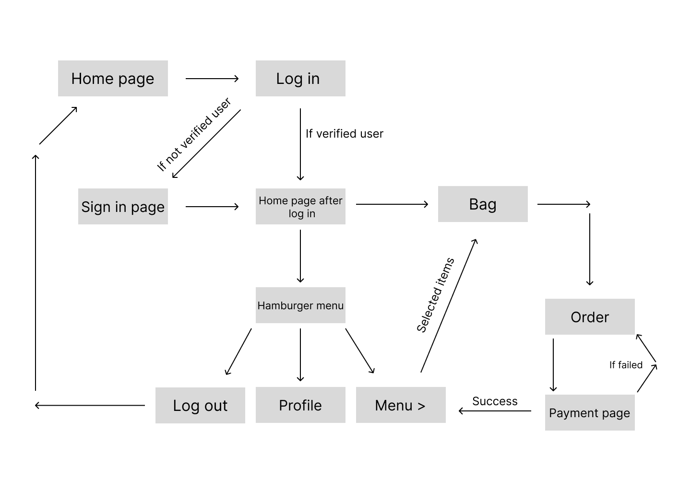

# Idea brief

## Introduction:

### purpose and objectives-

The purpose of the project is to introduce more people to the delicious South-Indian style breakfast and dinner served at the restaurant so that they can enjoy it with their loved ones. The main objective is to see our customers happy and satisfied with the delicious dishes we serve. 

### Brief description of the restaurant and its target audience-

The restaurant serves a wide variety of South-Indian styled items for breakfast and dinner. The essence of taste is from one of the famous places in Tamil Nadu - Madurai. The motherland had always served the people with traditional methods of cooking and hungerless people were kept happy throughout. We would want all our audience to enjoy the essence by reaching it to them safe and secure.

## System Architecture:

This project utilises the **MERN** stack for fully fledged data sharing. Various dependencies are used to enhance the smooth working of the application.

**MongoDB** - DataBase
**Express** - Framework used on top of node.js
**React** - Frontend framework
**Node.js** - Backend, api creation

# Features Involved

- Login/sign-up page
- Main page (where all items are displayed)
- A verified user email will have the access to edit the details shown on the site to make sure the items are available.
- A  clone of the digital payment system where a QR is generated which shows a textual message regarding the user
- A review page for users to express their review
- List table - which when a user adds an item, the particular item’s data are being reflected accordingly.
- A pin code sorting system that sorts the available places that food can be delivered.
- Will have a dine-in, take away and delivery service. And based on that the payment option will be reflected.

# Daily Plan

- Day 1 - Creating low fidelity design

- Day 2 - Creating a repository and writing readme.md file

- Day 3 - Creatin high fidelity design and prototype.

# Information Architecture

---